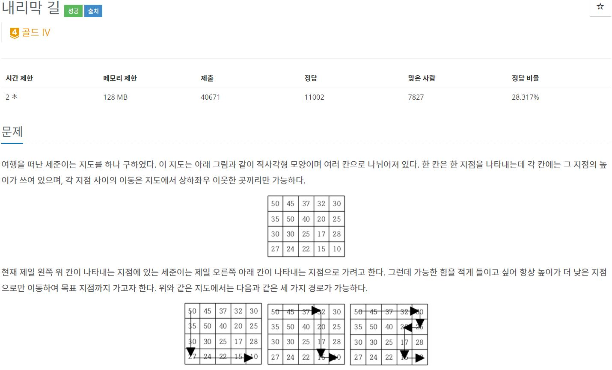

# BOJ 1520 내리막 길
## 문제 출처
[https://www.acmicpc.net/problem/1520](https://www.acmicpc.net/problem/1520)
<br/>


<br/>
<br/>

## 문제 해설
<br/>
이 문제를 처음 읽어봤을 때는 왼쪽 맨 위에서 오른쪽 맨 아래로 이동하는 경로의 개수를 구하는 걸로 봐서 이중 for문으로 오른쪽으로 이동하는 경우랑 아래로 이동하는 경우 두 가지만을 따져서 구하면 되는 줄 알았는데, 왼쪽으로 이동하는 경우랑 위로 이동하는 경우가 있어서 문제가 좀 까다롭다고 느꼈다.<br/>
<br/>
이중 for문을 한번만 이용하면 위로 이동하는 경우랑 왼쪽으로 이동하는 경우를 고려할 수 없기 때문에 이중 for문을 4번 돌게 되면 상,하,좌,우 다 고려해서 위로 이동하는 경우랑 왼쪽으로 이동하는 경우가 고려되지 않을까 생각하고 코드를 짜 보았다.<br/>
<br/>
혹시나 시간초과가 되지 않을까 생각했지만, 시간 제한은 2초에 지도의 크기는 500X500 이하고 지도의 모든 탐색을 4번하는데 500X500X4 =  1,000,000 으로 시간 초과는 문제 없을거라 생각했다.<br/>
<br/>

``` python
# 상, 하, 좌, 우
dx, dy = [-1, 1, 0, 0], [0, 0, -1, 1]

# 그래프의 세로, 가로의 수 입력
m, n = map(int, input().split())
# 각 지역의 높이 그래프 생성
graph = []
# DP 배열 생성 및 초기화
dp = [[0]*n for i in range(m)]

# 각 지역의 높이 입력
for i in range(m):
    graph.append(list(map(int, input().split())))
```
배열에서 상, 하, 좌, 우로 이동하기 위해 dx, dy 리스트를 하나 생성했고, DP를 이용해 왼쪽 맨 위에서 해당 지역에 갈 수 있는 경로를 찾을 dp 배열을 그래프의 크기만큼 생성해주고 0으로 초기화 시켜주었다.<br/>
<br/>

```python
# 맨 왼쪽 위 1로 초기화
dp[0][0] = 1

# 5번 순회
for k in range(5):
    for i in range(m):
        for j in range(n):
            # 맨 왼쪽 위는 무시
            if i == 0 and j == 0:
                continue
            # 탐색하는 지역에서 0으로 초기화한 후 상, 하, 좌, 우 지역에서 해당 지역으로 갈 수 있으면 더하기
            dp[i][j] = 0
            for d in range(4):
                nx, ny = i + dx[d], j + dy[d]
                if 0 <= nx < m and 0 <= ny < n:
                    if graph[nx][ny] > graph[i][j]:
                        dp[i][j] += dp[nx][ny]

# 결과값 출력
print(dp[-1][-1])
```
왼쪽 맨 위는 출발지점으로 1로 설정해 주었고, 처음에 k의 range를 4로 설정해 주었지만 채점 중에 86%에서 틀렸길래 5번으로 바꾸어 주었더니 맞았다..(생각없이 바꿔봤는데 이게 되네? 왜 맞았는지는 모르겠다..)<br/>
<br/>
이중 for문을 돌면서 현재 위치의 상, 하, 좌, 우 위치에서 현재 위치로 이동할 수 있으면 이동할 수 있는 경로이기 때문에 더해주었다.<br/>
<br/>
5번의 순회가 끝나게 되면 오른쪽 맨 아래로 이동할 수 있는 경로 결과값을 출력한다.<br/>
<br/>

위에서와 같이 4번을 순회하게 되면 틀렸고, 5번으로 바꾸어보니 맞았다..<br/>
<br/>
전체 코드는 다음과 같다.
```python
# Baekjoon 1520 내리막 길
# 문제 : https://www.acmicpc.net/problem/1520
import sys
input = sys.stdin.readline

# 상, 하, 좌, 우
dx, dy = [-1, 1, 0, 0], [0, 0, -1, 1]

# 그래프의 세로, 가로의 수 입력
m, n = map(int, input().split())
# 각 지역의 높이 그래프 생성
graph = []
# DP 배열 생성 및 초기화
dp = [[0]*n for i in range(m)]

# 각 지역의 높이 입력
for i in range(m):
    graph.append(list(map(int, input().split())))

# 맨 왼쪽 위 1로 초기화
dp[0][0] = 1

# 5번 순회
for k in range(5):
    for i in range(m):
        for j in range(n):
            # 맨 왼쪽 위는 무시
            if i == 0 and j == 0:
                continue
            # 탐색하는 지역에서 0으로 초기화한 후 상, 하, 좌, 우 지역에서 해당 지역으로 갈 수 있으면 더하기
            dp[i][j] = 0
            for d in range(4):
                nx, ny = i + dx[d], j + dy[d]
                if 0 <= nx < m and 0 <= ny < n:
                    if graph[nx][ny] > graph[i][j]:
                        dp[i][j] += dp[nx][ny]

# 결과값 출력
print(dp[-1][-1])
```